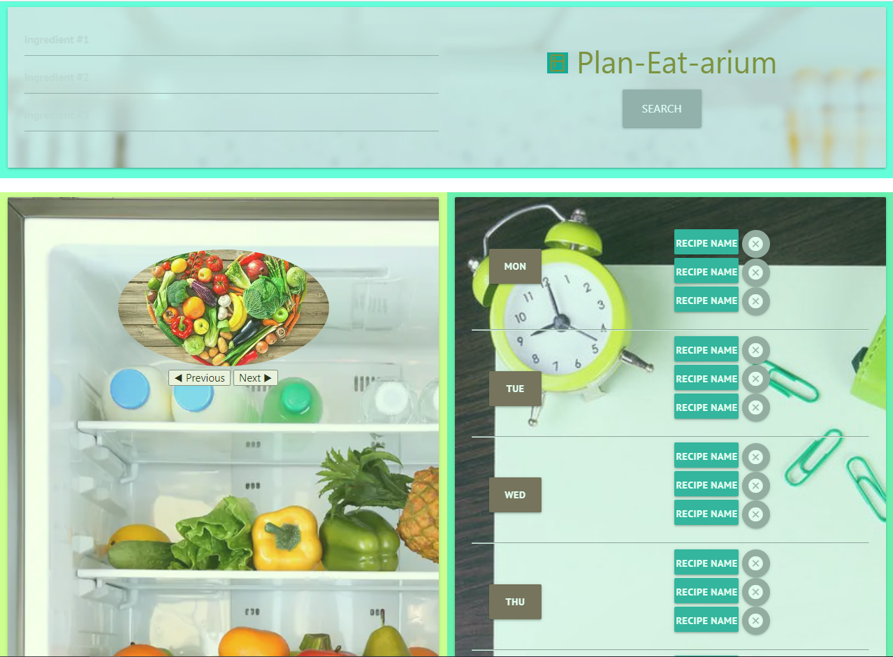
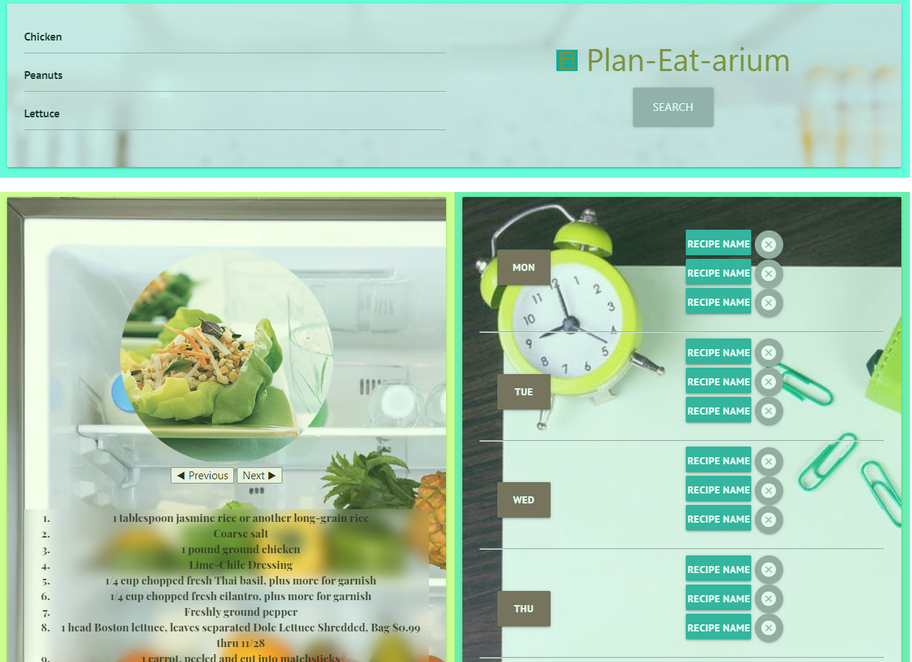
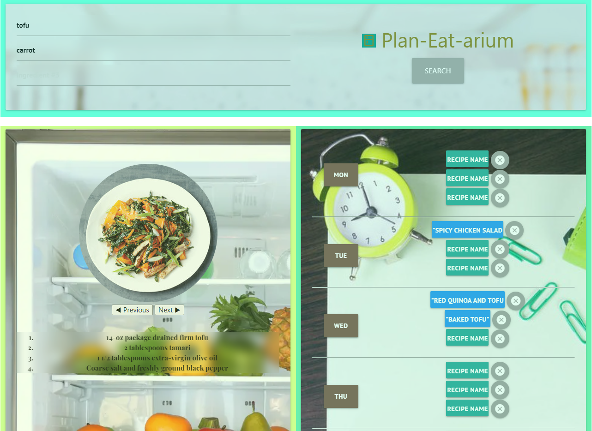

# plan-eat-rium.io
```
Dine-in helper application that helps you plan your weekly menu with various choices
```

## Description
```
The most challenging part of cooking is planning what you want to cook and when and what ingredients I have already and I what I need to buy, etc.
The actual part of cooking and following a recipe is the least challenging part.

This App is a perfect solution for that. 
This let's you search for recipes with the ingredients you have in the fridge. Give many recipe choices to choose from. It lists the recipe ingredients, so you can shop for the ingredients you may not have at home. 

It also lets you add the the recipe name and link to the weekly calendar, so that you can go back to it, on the day you are cooking to pull up the actual recipe.

```

## Technology & Tools Used
```
Front End                   : HTML, CSS, JavaScript, JQuery
Back End  & Data Storage    : AJAX and Local Storage
Version-Control             : GitHub
API                         : Edamam & Spoonacular Public APIs

```
## Credits
```
1) Materialize 
2) Font Awesome
3) Google FU
4) StackOverflow
5) Edamam API
6) Spoonacular API
```

## Screenshots to demonstrate the Application 
Initial page load view:


View of ingredients searched and result with recipes returned:


View with recipes pinned to specific weekday calendar:


## How to use
```
1) Enter upto 3 ingredients for which you need recipes for.
2) Upto 5 recipes are returned, which gets displayed in a carousel format.
3) When the user is interested in a recipe and would like to add it to the calendar, they click the appropriate weekday they would like to save it to.
4) Clicking the weekday will add the current item name and URL into the recipe slot that is open under that day.
5) Once that is added, the pinned recipe will appear everytime the user refreshes the page.
6) When the page is refreshed, the ingredient are cleared, so that the user is allowed to do new search.
7) To remove the pinned recipe, click the delete button (circle button with 'X' mark).
```

## URL

* The URL of the deployed application - https://meenaambalam.github.io/plan-eat-rium.io/

* The URL of the GitHub repository - https://github.com/meenaambalam/plan-eat-rium.io


